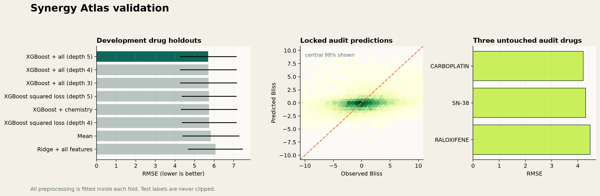

# Synergy Atlas

An end-to-end machine-learning project for predicting **Bliss drug-combination synergy in cancer cell lines**, with a polished local interface and validation centered on drugs absent from training.

   



## Try the interface

The trained 6.5 MB model artifact is included, so the UI does not require the raw research datasets.

```bash
python3 -m venv .venv
source .venv/bin/activate
pip install -r requirements.txt
./run_ui.sh
```

Open [http://127.0.0.1:7860](http://127.0.0.1:7860). The interface supports a single prediction, an empirical error band, and ranked CSV batch predictions. It deliberately labels results as research estimates rather than clinical recommendations.

## What the model learns from

The final representation is symmetric: swapping drug A and drug B produces the same prediction.

- **Both drugs:** 256-bit radius-2 Morgan fingerprints plus molecular weight, logP, TPSA, hydrogen-bond donors and acceptors, rotatable bonds, ring count, and fraction sp3 carbon.
- **Cell line:** the 96 most variable protein-coding expression features selected inside each training fold, standardized and reduced to 20 principal components.
- **Context:** train-fitted one-hot tissue and cancer-type features.
- **Estimator:** regularized depth-5 XGBoost with subsampling, column sampling, minimum child weight, and pseudo-Huber loss.

Chemistry comes from [PubChem PUG REST](https://pubchem.ncbi.nlm.nih.gov/docs/pug-rest). Cell-line identities and cancer labels come from [Cell Model Passports](https://cellmodelpassports.sanger.ac.uk/documentation). Gene expression is from **DepMap Public 24Q4**, protein-coding log2(TPM + 1).

## Validation design

The main question is whether the model can say anything useful about a drug it has never seen. Every held-out fold removes the selected chemical structure from **both** drug columns. Aliases and salts are standardized to parent structures before splitting, and all preprocessing is refitted on the training fold.

Seven development drugs were used to compare fixed candidates. An initial three-drug pilot audit exposed no labels to training, but after that result was inspected, it was not reused for the final claim. A fresh locked audit used **Carboplatin, SN-38, and Raloxifene** exactly once.

| Development candidate | Mean held-out RMSE | Mean MAE | Spearman |
| --- | ---: | ---: | ---: |
| Mean predictor | 5.834 | 4.147 | — |
| Ridge + all features | 6.068 | 4.475 | 0.142 |
| XGBoost + chemistry | 5.744 | 4.120 | 0.153 |
| XGBoost + all features, depth 3 | 5.714 | **4.083** | 0.192 |
| XGBoost + all features, depth 4 | 5.711 | 4.084 | 0.202 |
| **XGBoost + all features, depth 5** | **5.700** | 4.093 | **0.217** |

The selected model achieved the following on the fresh locked audit:

| RMSE | MAE | R² | Spearman | Test observations |
| ---: | ---: | ---: | ---: | ---: |
| **4.323** | **3.228** | **0.068** | **0.274** | 13,568 |

The positive R² and rank correlation show a modest generalizable signal. They do not support a claim of clinical accuracy. The model still shrinks strong effects toward the center, which is visible in the validation plot. The UI therefore reports an empirical 80% absolute-error band derived only from the locked audit (±5.115 Bliss points).

Training RMSE for the selected candidate averaged 5.124 versus 5.700 on development holdouts. That gap is monitored and is much smaller than an unconstrained tree ensemble would typically show, while the stronger squared-loss candidates failed to improve development performance. Training targets are capped to `[-100, 100]` to limit one unresolved extreme value; validation labels are never clipped.

## Data pipeline

```text
498,865 supplied rows
  └─ 405,465 unique unordered pair / cell observations after validation
      └─ 331,349 rows matched to curated human cancer cell lines
          └─ 269,175 rows with structures for both drugs
              └─ 214,583 rows with DepMap expression (97 drugs, 78 cell lines)
```

The pipeline excludes ambiguous cell aliases and labels such as malaria strains `3D7`, `HB3`, and `DD2`. If two names resolve to the same standardized parent structure, their observations are aggregated before splitting so aliases cannot receive extra weight.

## Reproduce training

Raw data is intentionally excluded from Git. Place these files before training:

```text
data/raw/drugcombs_scored.csv
data/raw/model_list_latest.csv.gz
data/raw/OmicsExpressionProteinCodingGenesTPMLogp1_24Q4.csv
data/processed/drug_structures.csv
```

Then run:

```bash
./train_production.sh
python -m unittest discover -s tests -v
```

The run writes fold metrics, compressed predictions, the model artifact, and a generated model-card figure. The split logic, aliases, feature transforms, and batch API are covered by 12 tests, including leakage prevention and drug-order invariance.

## Repository map

- `src/production.py` — curation, train-only feature fitting, model comparison, locked audit, final artifact.
- `src/curation.py` — exact unambiguous mapping to human cancer models and stable DepMap IDs.
- `src/chemical_benchmark.py` — PubChem standardization and chemistry ablations.
- `app/` — Flask API, responsive UI, batch ranking, and trained model artifact.
- `tests/` — data, split, chemistry, curation, and live API integration tests.
- `results/production/` — validation metrics, summary, and model-card figures.

## Scope

This model covers the 97 resolved drugs and 78 expression-matched cell-line labels listed by the UI. It does not infer chemistry for an arbitrary typed molecule, model dose-response surfaces, account for study/batch effects, or provide calibrated clinical probabilities. Stronger validation needs source-study identifiers, dose matrices, broader structure coverage, and independent external experiments.
